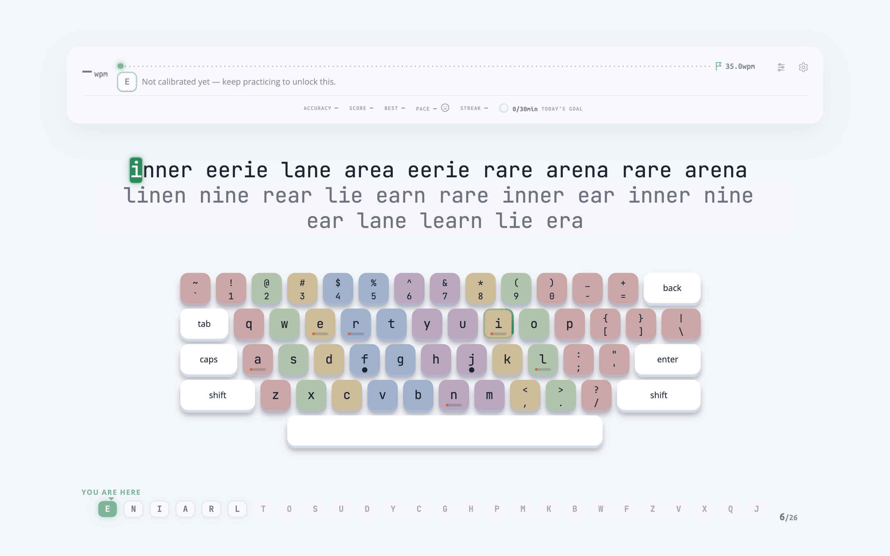
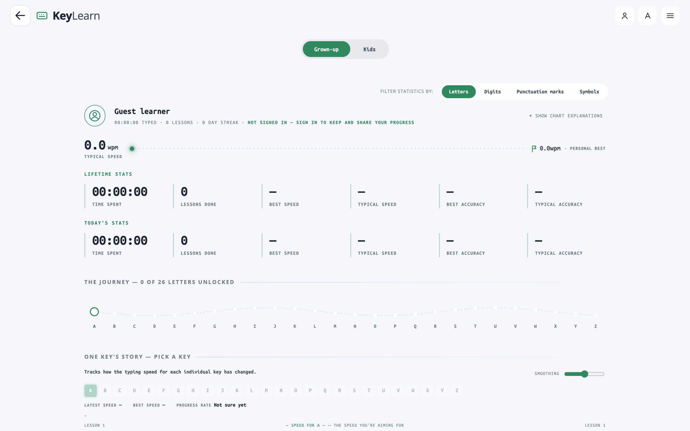
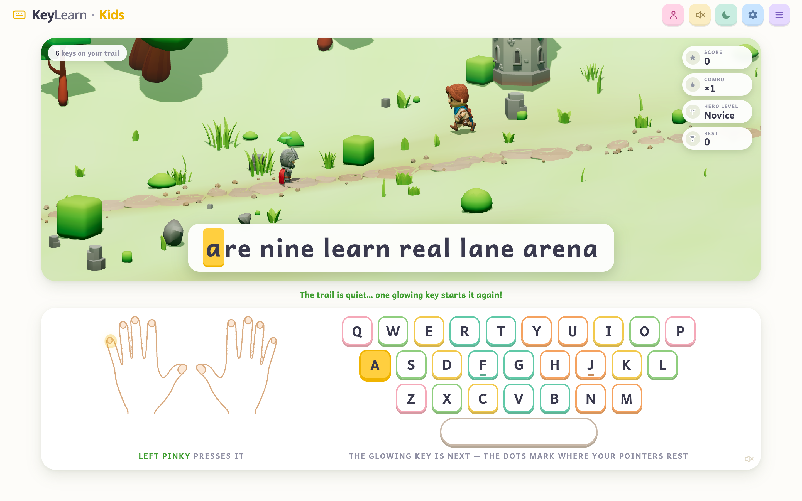
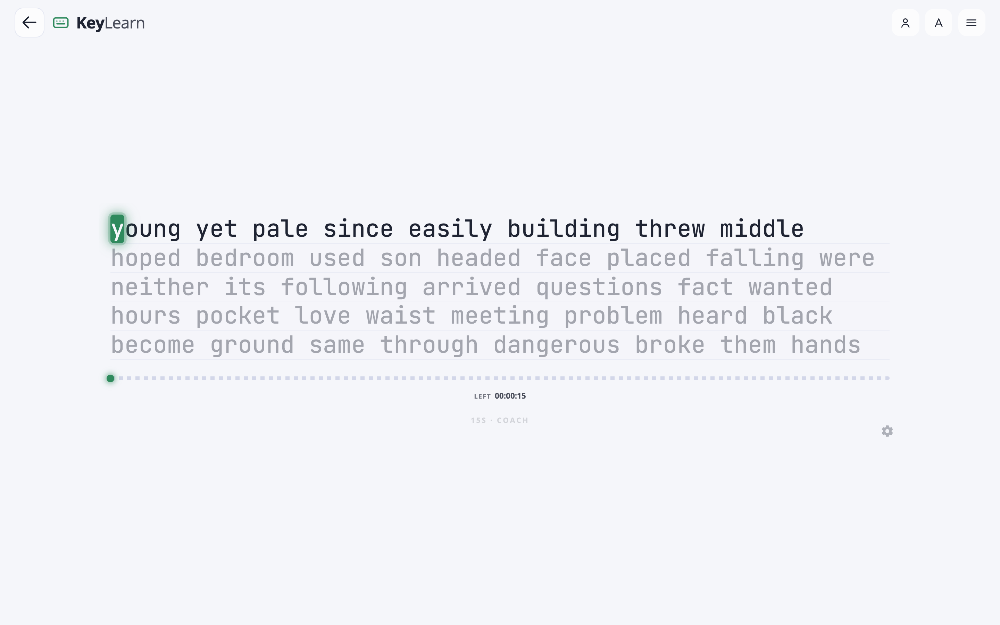
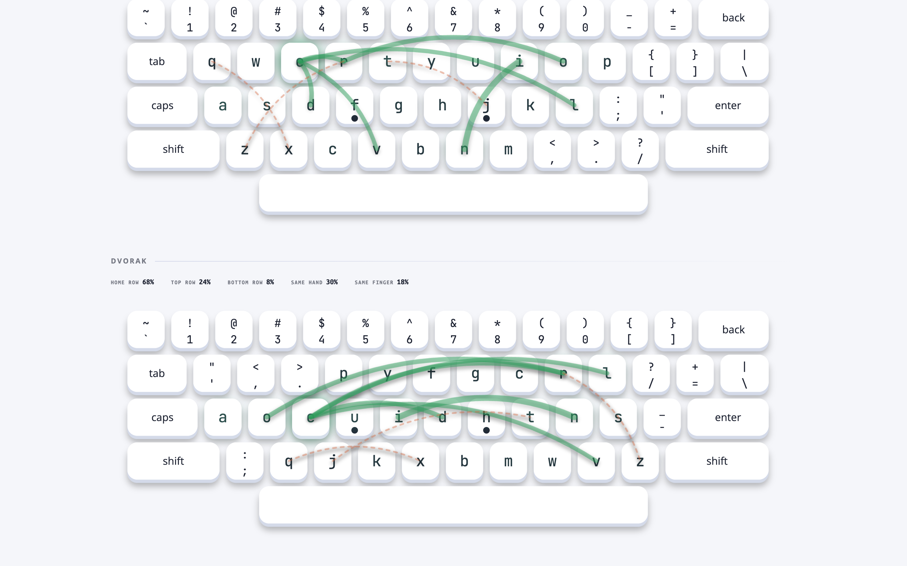

<h1 align="center">KeyLearn</h1>

<strong>A smart, adaptive touch-typing tutor — minimalist for adults, playful for kids.</strong>

  
  
  

  

> KeyLearn watches every keystroke, learns where you struggle, and builds each lesson around *your* weakest keys. It starts you on a handful of the most common letters and unlocks the rest of the alphabet only as you earn them — so you are always practising at the edge of your ability, never bored and never overwhelmed.

---

## Table of contents

- [Why KeyLearn](#why-keylearn)
- [Features](#features)
  - [The adaptive engine](#the-adaptive-engine)
  - [A playful world for kids](#a-playful-world-for-kids)
  - [Speed Test — three modes](#speed-test--three-modes)
  - [Household profiles](#household-profiles)
  - [Languages, layouts & locales](#languages-layouts--locales)
  - [Themes & customization](#themes--customization)
- [Tech stack](#tech-stack)
- [Getting started](#getting-started)
- [Roadmap](#roadmap)
- [Contributing](#contributing)
- [Acknowledgements](#acknowledgements)

---

## Why KeyLearn

Most typing tutors make you drill the same fixed lessons whether you need them or not. KeyLearn is different: it is **adaptive**. It measures your speed and accuracy on **every individual key**, generates fresh pseudo-words that target your weak spots, and predicts how many more lessons you need to hit your goal.

It is built for two very different people at once:

- **Adults** get a calm, distraction-free surface — just your text, your keys, and your progress.
- **Kids** get an encouraging, game-like world designed for learners who are often learning to *read* at the same time as they learn to type.

No account required to start.

---

## Features

### The adaptive engine

KeyLearn tracks per-key speed, accuracy, and confidence, then uses a phonetic model of your language to generate words that feel natural while concentrating on the letters you find hardest. When you consistently hit your target speed on the current set, the next letter unlocks — the row beneath the keyboard shows exactly where you are on that journey.

- **Per-key statistics** — every keystroke is measured, not just words-per-minute.
- **Weak-key targeting** — lessons are generated around the keys you miss most.
- **Gradual unlocks** — start with the most frequent letters; earn the rest.
- **Goal tracking & prediction** — set a target speed and watch KeyLearn project your path to it.

Your profile turns all of that into a story: lifetime and daily stats, a letter-by-letter unlock map, and a per-key speed history.

  

### A playful world for kids

Kids mode wraps the same engine in a warm, encouraging adventure: a hero runs a trail one keypress at a time, keys glow to show what comes next, and an illustrated pair of hands shows exactly which finger to use — perfect for children learning to read and type at once.

  

### Speed Test — three modes

A dedicated Speed Test, redesigned around typing psychology, with three distinct feels — and your choice of time or word-count length for each:

| Mode | Feel | What you see |
|------|------|--------------|
| **Zen** | Quiet & flow-focused | A single hairline progress track, no numbers to chase |
| **Coach** | Guided & reassuring | A qualitative pace cue measured against your personal best |
| **Arcade** | Energetic & competitive | A live speed readout, personal-best marker, and streaks |

Each run is distraction-free — the interface fades away as you type — and results persist so you can watch your **personal best**, **streak**, and **trajectory** grow over time.

  

### Household profiles

One account, many learners. Create a profile per family member — each with its own avatar, progress, unlocked keys, and streak — and switch between them on the device.

- **Per-profile progress** — separate stats, learned keys, and daily streaks.
- **Grown-up & kid profiles** — age-aware pacing and parental consent for children.
- **Account preferences** — language & region, notifications, appearance, data export.
- **Import from keybr** — bring your existing history over from keybr.com.

### Languages, layouts & locales

KeyLearn even shows you *how good your layout is*: circle size reflects how often each key is used, and arcs show how often each pair of keys is typed one after another — so you can compare QWERTY, Dvorak, Colemak, and more at a glance.

  

- **41 practice languages** with real phonetic word models — from English, Spanish, and German to Arabic, Hindi, Japanese, Tamil, and more.
- **116 keyboard layouts** — QWERTY, Dvorak, Colemak, Workman, AZERTY, QWERTZ, Neo, BÉPO, and many national and ergonomic variants.
- **57 interface locales** so the app itself speaks your language, RTL included.

### Themes & customization

- **Light, dark, and auto** themes tuned around KeyLearn's mint accent.
- A built-in **theme designer** to craft your own palette and export it as a `.keylearn-theme` file.
- Configurable practice text, whitespace, sounds, and on-screen keyboard.

---

## Tech stack

- **TypeScript** across the stack, in an npm-workspaces monorepo.
- **React** front end, built with **webpack**.
- **Node.js** server (clustered) with a **Knex**-backed database.
- **FormatJS** for internationalization; per-language phonetic models power lesson generation.

---

## Getting started

To launch a local instance, see **[docs/getting_started.md](./docs/getting_started.md)**.

Other guides:
- [Adding a custom language](./docs/custom_language.md)
- [Translations](./docs/translations.md)

---

## Roadmap

- **Kids mode**: kid-friendly vocabulary, typography, sounds, and celebrations.
- **Material 3 UI**: a modern, minimalist interface for both adults and kids.
- **Smarter practice engine**: bigram-level statistics, accuracy-aware progression, and skill-decay modeling.
- **Refreshed corpora**: multi-language word lists built from openly licensed sources.

---

## Contributing

Issues and pull requests are welcome.

---

## Acknowledgements

KeyLearn is a fork of **[keybr.com](https://github.com/aradzie/keybr.com)** by Aliaksandr Radzivanovich — an outstanding open-source typing tutor. The adaptive lesson engine, phonetic word models, and much of this project's foundation originate there.
